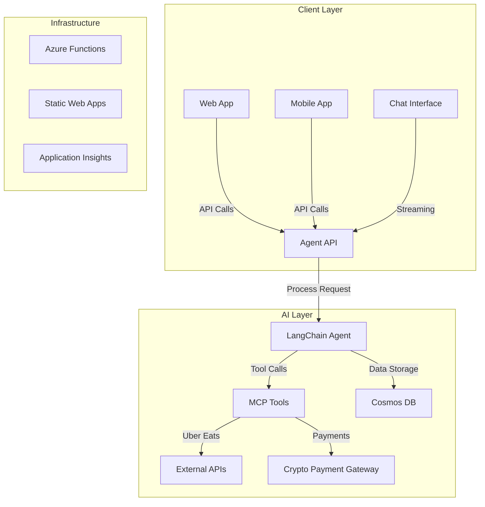
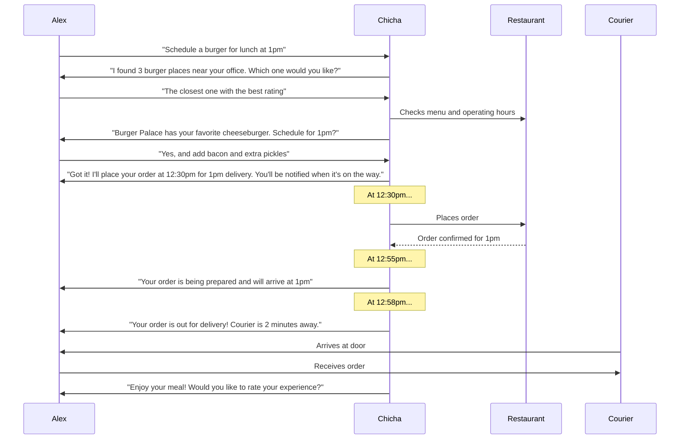
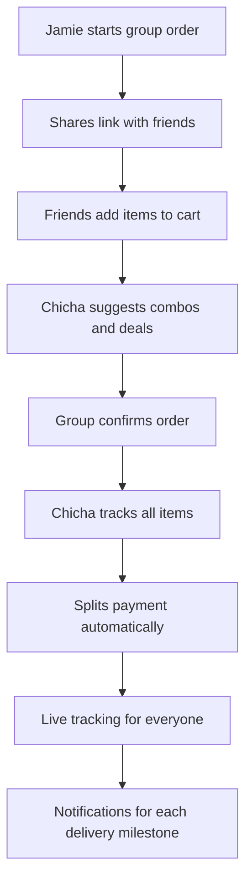

<div align="center">


# Chicha — The AI Burger Agent

[](https://codespaces.new/Azure-Samples/mcp-agent-langchainjs?hide_repo_select=true&ref=main&quickstart=true)

[](https://www.typescriptlang.org)
[](LICENSE)

**Chicha** is a production-ready AI Agent capable of bridging the gap between natural language and real-world food delivery logistics. Unlike simple chatbots, Chicha connects directly to delivery platforms (like Uber Eats) to manage the full lifecycle of a meal.

[Overview](#overview) • [Architecture](#architecture) • [Getting Started](#getting-started) • [Deployment](#deployment) • [Contributing](#contributing)

</div>

## Overview

This project demonstrates a serverless AI agent architecture using **LangChain.js** and the **Model Context Protocol (MCP)**. It is designed to move beyond simple text generation into "Agentic AI"—software that takes action.

### Core Capabilities (Live & Planned)
- **🧠 Context-Aware AI**: Remembers your dietary preferences, location, and order history
- **🔌 Real Integrations**: Seamless connection to Uber Eats API for live restaurant discovery and ordering
- **📍 Geo-Location**: Smart location-based restaurant discovery with fallback options
- **🛍️ Unified Ordering**: Consistent interface across multiple delivery platforms
- **🔐 Secure Authentication**: OAuth 2.0 with secure token management
- **📊 Real-time Updates**: Live order tracking and status notifications

## Architecture

### High-Level Architecture



### Component Details

| Service | Role | Tech | Key Features |
| ------- | ---- | ---- | ------------ |
| **Agent Web App** | Frontend Interface | React/Lit, TypeScript | Real-time chat, geolocation, responsive UI |
| **Agent API** | AI Orchestration | Node.js, LangChain.js | Natural language processing, tool orchestration |
| **Burger MCP** | API Integration | Azure Functions | Standardized tool interface for external services |
| **Burger API** | Business Logic | Node.js, Cosmos DB | Order management, user profiles, payment processing |

## Getting Started

### Prerequisites

- Node.js 18+
- Azure account
- Uber Eats Developer Account
- Azure CLI with `azure-dev` extension

### Local Development

1. **Clone the repository**
   ```bash
   git clone https://github.com/yourusername/chicha-ai-burgers.git
   cd chicha-ai-burgers
   ```

2. **Install dependencies**
   ```bash
   npm install
   ```

3. **Set up environment variables**
   ```bash
   cp .env.example .env
   # Edit .env with your credentials
   ```

4. **Start development servers**
   ```bash
   npm run dev
   ```

## Deployment

### Azure Deployment

The entire stack is defined in Infrastructure-as-Code (Bicep) for one-click deployment.

```bash
# Install Azure Developer CLI
azd auth login
azd up
```

This will provision:
- Azure OpenAI Service
- Azure Cosmos DB (Serverless)
- Azure Functions (Flex Consumption)
- Azure Static Web Apps
- Application Insights

### Environment Configuration

Update the following environment variables in your Azure deployment:

```bash
# Required for Uber Eats Integration
UBER_CLIENT_ID=your_client_id
UBER_CLIENT_SECRET=your_client_secret
UBER_REDIRECT_URI=your_redirect_uri

# Required for Azure Services
AZURE_OPENAI_API_KEY=your_openai_key
COSMOS_CONNECTION_STRING=your_cosmos_connection_string
```

## Development Workflow

### Code Structure

```
chicha-ai-burgers/
├── packages/
│   ├── agent-api/         # LangChain.js agent and API endpoints
│   ├── agent-webapp/      # React frontend
│   ├── burger-api/        # Core business logic and database
│   └── burger-mcp/        # MCP tools and integrations
├── infra/                 # Bicep templates
└── docs/                  # Documentation
```

### Testing

Run the test suite:

```bash
npm test
```

For end-to-end testing:

```bash
npm run test:e2e
```

## Contributing

We welcome contributions! Please see our [Contributing Guidelines](CONTRIBUTING.md) for details.

1. Fork the repository
2. Create your feature branch (`git checkout -b feature/AmazingFeature`)
3. Commit your changes (`git commit -m 'Add some AmazingFeature'`)
4. Push to the branch (`git push origin feature/AmazingFeature`)
5. Open a Pull Request

## Real-Life Scenarios

### 1. The Busy Professional's Lunch Order

**Scenario**: Alex has back-to-back meetings but needs to schedule lunch.



### 2. Group Order for Game Night

**Scenario**: Jamie is hosting friends and needs to order for the group.



### 3. Late-Night Craving with Special Requests

**Scenario**: Taylor gets hungry at midnight with specific dietary needs.

1. **Initial Request**:
   - Taylor: "I want a vegan burger with gluten-free bun, no onions, extra pickles"
   - Chicha: "I found 2 places open now that can accommodate your request. Here are your options..."

2. **Order Customization**:
   - Chicha confirms each modification
   - Suggests complementary items (vegan milkshake?)
   - Provides ETA and tracks order in real-time

3. **Delivery**:
   - Sends "5 minutes away" notification
   - Provides courier details and real-time location
   - Confirms delivery completion

### 4. Scheduled Weekly Meal Prep

**Scenario**: Sam wants to schedule healthy meals for the workweek.

```mermaid
timeline
    title Sam's Weekly Meal Schedule
    section Monday
        12:00 PM: Protein Bowl from Fresh & Co
    section Wednesday
        12:30 PM: Grilled Chicken Salad
    section Friday
        1:00 PM: Cheat Day Burger
```

**Features Demonstrated**:
- Recurring orders
- Meal planning
- Dietary preference memory
- Automatic payment
- Delivery time optimization

### 5. Corporate Catering Order

**Scenario**: Preparing for a team of 20 with specific requirements.

1. **Bulk Ordering**:
   - Multiple meal options
   - Individual packaging
   - Special instructions per person

2. **Logistics**:
   - Scheduled delivery window
   - Contactless delivery setup
   - Expense reporting integration

3. **Post-Order**:
   - Digital receipts
   - Team feedback collection
   - Favorite orders saved for next time

## Roadmap

### Current Focus
- [ ] Real-time order tracking with WebSockets
- [ ] Multi-language support
- [ ] Advanced dietary preference handling

### Upcoming Features
- [ ] Voice interface integration
- [ ] Group ordering
- [ ] AI-powered menu recommendations

## Resources

- [Model Context Protocol](https://modelcontextprotocol.io/)
- [LangChain.js Documentation](https://js.langchain.com)
- [Uber Eats API Documentation](https://developer.uber.com/docs/eats/introduction)
- [Azure Functions Documentation](https://docs.microsoft.com/azure/azure-functions/)
- [Cosmos DB Documentation](https://docs.microsoft.com/azure/cosmos-db/)

## License

This project is licensed under the MIT License - see the [LICENSE](LICENSE) file for details.

## Support

For support, please [open an issue](https://github.com/yourusername/chicha-ai-burgers/issues) or reach out to our team at support@chicha.ai
