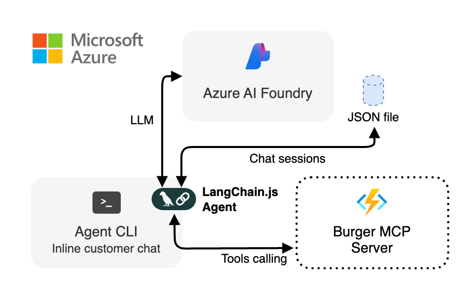

<div align="center">

# Agent CLI (LangChain.js)


[](https://www.typescriptlang.org)
[](https://js.langchain.com)

[Overview](#overview) • [Usage](#usage) • [Development](#development) • [Troubleshooting](#troubleshooting)

</div>

## Overview

The Agent CLI is a minimal command line interface to the same burger ordering LangChain.js agent used by the web experience. It connects directly to the Burger MCP server and uses Azure OpenAI for reasoning. Conversation state is persisted locally in a JSON file so you can build context across multiple invocations.

It is useful for:

- Rapid prototyping / debugging tool calls
- Local experimentation without the web UI
- Understanding LangChain.js agent setup in a simplified context

<div align="center">
	
</div>

## Installation

Follow the instructions [here](../../README.md#getting-started) to set up the development environment for the entire Burger MCP Agents project.

Then run the following commands from the repository root:

```bash
cd packages/agent-cli
npm start "show me a spicy burger"
```

You should see a connection message to the Burger MCP server then the streamed assistant answer.

### Global CLI install (optional)

You can build and install the CLI globally to call it directly as `agent-cli`:

```bash
npm run build
npm install -g .
agent-cli "show me a spicy burger"
```

## Usage

Invoke with a natural language question or instruction about burgers or orders. The agent will refuse unrelated topics.

```bash
# Basic menu query
npm start "show me the burger menu"

# Place an order (will ask for userId if missing)
npm start "place an order for 2 classic burgers"

# Provide user id explicitly
npm start "place an order for 1 veggie burger" -- --userId user123

# Cancel an order (new clean session)
npm start "cancel order 42" -- --userId user123 --new

# Force local MCP endpoint (bypass BURGER_MCP_URL)
npm start "what toppings are available" -- --local

# Verbose mode shows intermediate tool steps
npm start "status of my recent orders" -- --userId user123 --verbose
```

> [!TIP]
> If you installed the CLI globally you can replace `npm start` with `agent-cli` and omit the `--` before options.

### Options

| Flag            | Description                                                           |
| --------------- | --------------------------------------------------------------------- |
| `--userId <id>` | Specify the user identity (required for placing or cancelling orders) |
| `--new`         | Start a fresh session (ignores prior conversation)                    |
| `--verbose`     | Print intermediate LLM + tool invocation steps                        |
| `--local`       | Force `http://localhost:3000/mcp` instead of `BURGER_MCP_URL`         |
| `--help`        | Display usage information                                             |

### Conversation history

Session data (messages + last used userId) is stored at:

```
~/.burger-agent-cli/burger-agent-cli.json
```

Delete that file or use `--new` to reset context.

### Environment Variables

| Variable                    | Required | Purpose                                                       | Default                     |
| --------------------------- | -------- | ------------------------------------------------------------- | --------------------------- |
| `AZURE_OPENAI_API_ENDPOINT` | Yes      | Azure OpenAI endpoint used for chat completions               | –                           |
| `AZURE_OPENAI_MODEL`        | No       | Model name for the LLM                                        | `gpt-5-mini`                |
| `BURGER_MCP_URL`            | No\*     | Streamable HTTP MCP endpoint                                  | `http://localhost:3000/mcp` |
| `AGENT_WEBAPP_URL`          | No       | Used in prompt to guide users where to retrieve their user ID | `http://localhost:4280`     |

<sup>\*</sup>When not set the CLI falls back to the local development endpoint. Set this when targeting a deployed MCP server.

Authentication to Azure OpenAI uses `DefaultAzureCredential`. Ensure you are logged in by running either `azd auth login` or `az login`.

## Development

### Available Scripts

| Script          | Description                               |
| --------------- | ----------------------------------------- |
| `npm start`     | Build then run a single agent interaction |
| `npm run build` | Compile TypeScript to `dist`              |
| `npm run watch` | Incremental compile in watch mode         |
| `npm run clean` | Remove build artifacts                    |

## Troubleshooting

- Missing `AZURE_OPENAI_API_ENDPOINT`: set it in the root `.env` or export it in your shell
- Repeated auth failures: re-run `az login` or clear cached Azure credential tokens
- MCP connection issues: ensure the MCP server is running and `BURGER_MCP_URL` is correct
