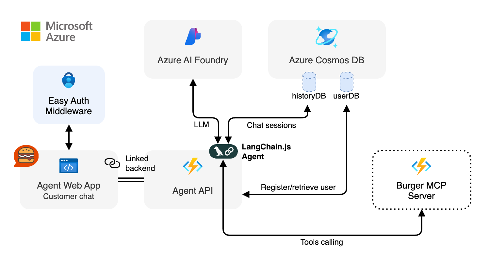

<div align="center">

# Agent Web App (Azure Static Web Apps)

[](https://codespaces.new/Azure-Samples/mcp-agent-langchainjs?hide_repo_select=true&ref=main&quickstart=true)

[](https://www.typescriptlang.org)
[](https://lit.dev)

[Overview](#overview) • [Development](#development)

</div>

## Overview

The Agent Web App provides a chat user interface for ordering burgers via the LangChain.js agent hosted in `agent-api`. It renders:

- Live streaming assistant responses (token + tool step updates)
- Chat session history with titles
- User identity card (derived from SWA auth)
- Debug panel (optional intermediate step visibility)

All tool interactions are delegated to the MCP server through the API; the web app itself stays purely UI + streaming logic.

<div align="center">
	
</div>

### Features

- **Reusable Web Components** (`<azc-chat>`, `<azc-auth>` `<azc-history>`, `<azc-user-card>`, `<azc-debug>`): building blocks that you can customize and integrate in your own apps
- **User authentication**: integrates with Azure Static Web Apps easy auth
- **NDJSON streaming parser**: process JSON streams with incremental DOM updates
- **Safe markdown rendering**: use DOMPurify and marked to safely render user and agent content
- **Chat session history**: switch between sessions, with lazy loading of messages

## Development

### Getting started

Follow the instructions [here](../../README.md#getting-started) to set up the development environment for the entire Burger MCP Agents project.

### Run the application

Use the following command to run the application locally:

```bash
npm start
```

This command will start the [Azure Static Web Apps CLI](https://learn.microsoft.com/azure/static-web-apps/local-development?tabs=azure-cli) which in turn runs both the [Vite](https://vitejs.dev/) development server and the Azure Functions emulator with the Agent API. This will allow you to test the website locally, using the URL `http://localhost:4280`.

> [!IMPORTANT]
> The Agent API needs the Burger MCP server and Burger API to be running as well. You can start all the service at once by running `npm start` in the root of the project.

### Available Scripts

| Script               | Description                                                            |
| -------------------- | ---------------------------------------------------------------------- |
| `npm start`          | Start web app + local Functions API via SWA CLI (recommended full dev) |
| `npm run start:mock` | Start web app + mock API responses (from `mocks/`)                     |
| `npm run dev`        | Vite dev server only (no API auto‑start)                               |
| `npm run build`      | Production build to `dist` (code‑split + sourcemaps)                   |
| `npm run clean`      | Remove `dist`                                                          |

### Configuration

| Variable                 | Description                                                                   | Default            |
| ------------------------ | ----------------------------------------------------------------------------- | ------------------ |
| `AGENT_API_URL_OVERRIDE` | Override base URL for Agent API (useful when pointing at a remote deployment) | ``(relative`/api`) |

### Debugging intermediate agent steps

By default you'll see a small button on top of the agent response panel that lets you open the debug panel. This shows the intermediate steps as they are received from the API, including LLM calls and tool invocations.

Each step can be expanded to see details like the full LLM response or tool input/output.

You can disable this by setting the `enableDebug` property on the `<azc-chat>` component to `false`.
